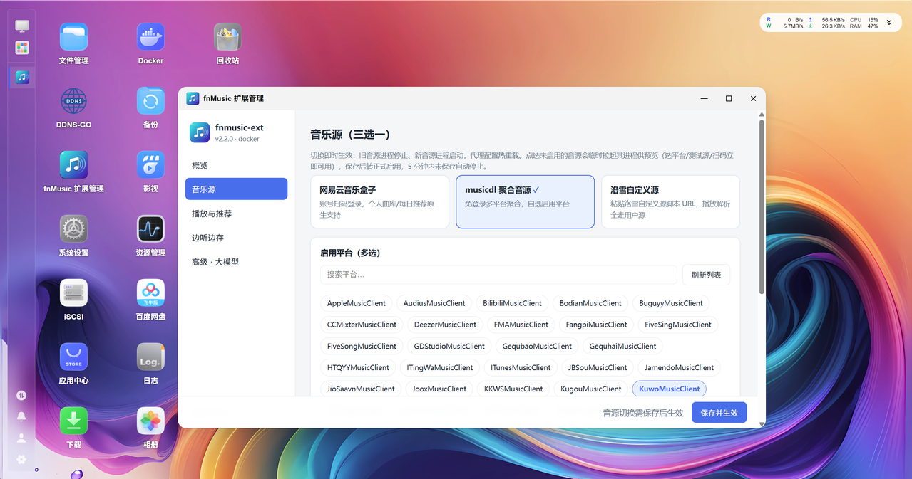

# fnmusic-ext 飞牛音乐扩展代理

Gitee：https://gitee.com/javycoder/fnos_music_ext

GitHub：https://github.com/javycoder/fnos_music_ext

[](https://github.com/javycoder/fnos_music_ext/actions/workflows/ci.yml)

`fnmusic-ext` 是专为 fnOS（飞牛私有云）自带音乐应用（`trim.music`）打造的**无侵入增强扩展**。它通过接管官方后端的 Unix Socket 通信入口，在完全不修改官方程序、nginx 配置与数据库的前提下，让原生飞牛音乐获得在线音乐能力；可随时一条命令还原官方直连。



## 功能特性

- **在线聚合搜播**：在官方搜索框输入歌名，聚合三大音源之一的曲库（见下），在线歌曲即点即播，自动补齐滚动歌词与高清封面；
- **三音源单选**（v2.0.0 起互斥，可在 WebUI 秒级切换）：
  - [musicbox](https://github.com/darknessomi/musicbox)：网易云高品质解析，支持扫码登录 VIP/无损曲库与原生每日推荐；
  - [musicdl](https://github.com/CharlesPikachu/musicdl)：酷我/咪咕等 57 个平台聚合，可按平台粒度勾选（编号见 [musicdl-service/PLATFORMS.md](musicdl-service/PLATFORMS.md)）。部分音乐源歌曲少，或返回的音乐不可播放，请自行测试并使用可靠音乐源；
  - **lxmusic**：洛雪音乐自定义源运行时——搜索/歌词/榜单走内置平台接口，播放解析由你提供的洛雪自定义源脚本（Node 沙箱隔离运行）完成。搜索结果以及能否播放，视提供的音乐源 URL 而定，请自行测试并使用可靠的 URL 脚本；
- **管理 WebUI**（可选，端口 8774）：浏览器里完成音源切换、musicdl 平台勾选、网易扫码、洛雪源测试与保存、音质偏好、边听边存、推荐开关与 LLM 配置，全部热生效；
- **音质偏好**：`高音质`（从高到低）/ `平衡`（取中间档）/ `流畅`（优先最低）三种模式，覆盖全部音源；
- **智能边听边存**：在线听歌时后台自动缓存，再次播放本地秒开；可选完整试听后保存进本地曲库；
- **推荐体系**：「热门推荐」与「每日推荐 MM-DD」两个独立歌单、独立开关；默认采信音源原生推荐，未启用网易时可配 OpenAI 兼容大模型兜底；歌单封面取列表里第一首有封面的曲目；
- **多用户隔离收藏**：家庭多成员的红心收藏彼此独立，与本地曲库融合。

## 架构

```text
[飞牛音乐客户端 Web / App / 车载]
            │
            ▼
      [飞牛 Nginx]（Unix Socket）
            │
┌─────────────────────────────────────────────────────────┐
│ fnmusic-ext 代理（宿主机 systemd，零侵入接管 Socket）     │
│   ├─ 本地接口透传 ──► 官方后端 (upstream socket)          │
│   ├─ 在线搜索/播放/歌词/封面/收藏                         │
│   ├─ 边播边存 Tee 落盘                                   │
│   └─ .env 热重载（2s 检测，白名单键免重启生效）           │
└───────────────┬─────────────────────────────────────────┘
                │ 127.0.0.1（仅 musicbox/WebUI 暴露局域网）
┌───────────────▼─────────────────────────────────────────┐
│ Docker 单容器 fnmusic-sources（supervisor 按需加载）      │
│   ├─ musicdl  127.0.0.1:8768 → 容器 8001                 │
│   ├─ musicbox 0.0.0.0:8770  → 容器 8002（扫码）          │
│   ├─ lxmusic  127.0.0.1:8772 → 容器 8003                 │
│   └─ WebUI    0.0.0.0:8774  → 容器 8004                  │
│   只启动当前所选音源进程（+可选 WebUI），其余不驻留内存；  │
│   切换音源 = supervisorctl 秒级 stop/start                │
└─────────────────────────────────────────────────────────┘
```

核心代理必须在宿主机以 systemd 运行（接管 Socket）；三个音源 + WebUI 合并为一个 Docker 容器，镜像内由 supervisor 管理四个程序，启动时读取挂载的 `.env` 只拉起所选进程——常驻内存约 100-200MB。

## 快速开始

### 前置条件

1. fnOS 已在「应用中心」安装并启动官方**飞牛音乐**应用；
2. fnOS 已安装 **Docker**（v2.0.0 起仅支持 Docker 部署音源，未安装 Docker 会直接报错退出）。

### 安装（推荐：应用中心 fpk 包）

从 [GitHub Releases](https://github.com/javycoder/fnos_music_ext/releases) 下载最新 `fnmusic-ext-<版本>.fpk`，在 fnOS「应用中心 → 手动安装」选择该文件，按向导选择**初始音源**即可自动完成安装并启用。

- 桌面会出现「fnMusic 扩展管理」图标，点击即在飞牛桌面窗口内打开管理页（音源切换/扫码登录/平台选择）；
- 在应用中心可随时「停止」（秒级还原官方直连）与「启动」（恢复扩展）；
- 卸载前会自动把配置与数据（.env、网易云登录、收藏、播放历史）备份为存储卷根目录的 `fnmusic-ext-backup-<时间戳>.tar.gz`，需要彻底清理时手动删除该文件即可；
- 也可用命令行安装：`sudo appcenter-cli install-fpk fnmusic-ext-<版本>.fpk`。

> 升级：应用中心内直接安装新版本 fpk（升级前自动备份用户数据，升级后恢复）。命令行 `install-fpk` 在已安装时不会升级，请在应用中心操作。

### 安装（进阶：git clone 脚本安装）

适合需要修改代码或精细控制参数的用户：

```bash
sudo apt-get update && sudo apt-get install -y python3 python3-venv git
git clone https://github.com/javycoder/fnos_music_ext.git fnmusic_ext
cd fnmusic_ext
chmod +x install.sh extend.sh restore.sh proxy/run_proxy.sh
./install.sh
```

向导依次引导：**音源三选一**（1 网易云 musicbox → 扫码登录；2 musicdl → 平台多选；3 洛雪 → 输入自定义源 URL 并实时校验）→ **是否安装管理 WebUI**（默认否）→ 可选 LLM 推荐配置 → 自动执行 `./extend.sh` 接管验收。

非交互示例：

```bash
# 网易云 + WebUI
./install.sh --non-interactive --sources musicbox --webui --extend

# musicdl（酷我+咪咕精选）
./install.sh --non-interactive --sources musicdl --extend

# 洛雪自定义源（--lx-source-url 非交互必填，安装时全链路校验；
# 源故障不让安装卡死可加 --lx-skip-verify，装好在管理页 WebUI 查看）
./install.sh --non-interactive --sources lxmusic \
  --lx-source-url 'https://example.com/your-source.js' --extend
```

### 验证

```bash
# 组件健康状态
curl -s --unix-socket /var/run/trim_music.socket http://localhost/_ext/healthz

# WebUI（若安装）：浏览器打开 http://<NAS_IP>:8774
```

打开飞牛音乐 Web 端或 App，搜索「晴天」等关键词即可试听在线歌曲。

### 日常运维

```bash
./extend.sh          # 重新启用/自检（改 .env 后重启容器并验收）
./restore.sh         # 秒级还原官方直连（保留 .env 与全部数据）
./restore.sh --full  # 彻底清理（连配置/登录态/缓存/收藏一并删除）
```

网易云扫码（musicbox 源）：终端 `./install.sh --qr`，或浏览器访问 `http://<NAS_IP>:8770/api/v1/auth/login/qr.png`。

> 部署形态细节、单机多副本约束（`--adopt`）、洛雪源配置与故障排查见 [docs/INSTALL.md](docs/INSTALL.md)。

## 配置参考

配置集中在项目根目录 `.env`（安装向导生成维护，权限 600），完整键项见 [.env.example](.env.example)。常用项：

| 配置项 | 默认值 | 说明 |
| :--- | :--- | :--- |
| `FNMUSIC_MUSICDL_ENABLED` / `FNMUSIC_NETEASE_ENABLED` / `FNMUSIC_LX_ENABLED` | 单选 | 三音源互斥开关，只能一个为 `true`（热重载） |
| `FNMUSIC_WEBUI_ENABLED` | `false` | 管理 WebUI 开关（端口 8774，无鉴权） |
| `LX_SOURCE_URL` | *(空)* | 洛雪自定义源脚本 URL；建议在 WebUI 里「测试并保存」 |
| `LX_SOURCES` | `kg,wy,mg,kw` | lxmusic 启用的平台（kg/wy/mg/kw/tx） |
| `FNMUSIC_ONLINE_SOURCES` / `MUSICDL_SOURCES` | 酷我+咪咕 | musicdl 平台白名单（短名/全名均可） |
| `FNMUSIC_QUALITY_MODE` | `high` | 音质偏好：`high` / `balanced` / `smooth`（热重载） |
| `FNMUSIC_TEE_SAVE_ENABLED` | `true` | 边听边存开关；`FNMUSIC_TEE_SAVE_DIR` 留空自动探测飞牛共享曲库 |
| `FNMUSIC_TEE_CACHE_MAX` | `2` | 关闭边听边存时滚动保留的试听缓存条数（仅关闭时生效） |
| `FNMUSIC_RECOMMEND_HOT` / `FNMUSIC_RECOMMEND_DAILY` | `true` | 「热门推荐」/「每日推荐」两个独立歌单的开关（热重载） |
| `FNMUSIC_COVER_ENRICH` | `true` | 缺失封面用网易曲库补全（热重载） |
| `FNMUSIC_LLM_BASE_URL` 等 | *(空)* | 大模型每日推荐兜底（OpenAI 兼容，热重载） |
| `FNMUSIC_ENV_WATCH` | `true` | .env 热重载总开关 |

## 从 v1.x 升级

v2.0.0 是**架构级重构**：部署形态（三容器→单容器）、数据目录（`musicbox-data/`→`sources-data/`）、配置键（`LX_THIRD_PARTY` 移除）均有变化。**推荐先还原再安装**，让升级从干净状态开始（`.env` 与全部数据保留，不会丢配置）：

```bash
cd /path/to/fnmusic_ext
git pull
./restore.sh      # 先还原官方直连并清理旧部署（v2 的 restore 兼容清理 v1.x 旧容器/宿主机服务）
./install.sh      # 全新安装 v2.0.0，按向导三选一
```

直接原地升级（`git pull && ./install.sh`）同样支持——安装器会自动迁移数据目录、清理旧三容器，遇到多源并存的旧 `.env` 会要求重新三选一。但机器状态复杂时（曾混用 host/Docker 模式、历经多次版本升级），先 `./restore.sh` 再安装更稳妥省心。

另注意两点行为变化：

1. **三音源互斥**：旧版多音源并存的 `.env` 会被要求重新单选（想换源时在 WebUI 里秒切）；
2. **`LX_THIRD_PARTY` 移除**：lxmusic 不再内置第三方聚合解析链，播放解析完全由你的洛雪自定义源脚本提供（安装或 WebUI 中配置）。

平台编号变化：`53`（zhuolin）已随上游 musicdl 2.13.11 下线退役，编号永久空缺；新增 `64`（yinyueku）。

## 常见问题

- **WebUI 打不开 / 提醒**：WebUI 无鉴权，仅限可信内网使用；确认安装时选择了 WebUI，或设置 `FNMUSIC_WEBUI_ENABLED=true` 后运行 `./extend.sh`。
- **洛雪源播放失败**：源脚本由第三方提供，在容器内 Node 沙箱中运行——请在 WebUI 中用「测试」按钮验证源可用性，失败时更换源 URL。
- **musicdl 某平台搜索为空**：上游接口变化所致，不影响其他平台；可升级 musicdl（`>=2.13.11`）后重建镜像。
- **切源后内存没有变化**：切换在容器内完成，`docker stats fnmusic-sources` 稍等片刻后查看；未启用音源进程会被停止而非休眠。
- **改了 `.env` 不生效**：热重载仅覆盖白名单键（音源开关/音质/推荐/边听边存/LLM 等）；路径、端口、平台白名单类改动需执行 `./extend.sh` 重启容器。

## 开发与测试

```bash
python3 -m pytest        # 全量测试（无需 Docker/飞牛环境）
```

仓库结构：`proxy/`（核心代理）、`musicdl-service/`、`musicbox-service/`、`lxmusic-service/`（容器内音源）、`webui-service/`（管理界面）、`container/`（单容器构建与编排）、`packaging/fpk/`（应用中心 fpk 打包）。

### fpk 打包与发布

```bash
./packaging/fpk/build.sh   # 本地打包：组装 + fnpack 校验 → dist/fnmusic-ext-<版本>.fpk
```

- 版本号唯一来源为根目录 `VERSION`，打包时注入 manifest；
- CI 在每次 push/PR 都会构建一次 fpk 防止结构回归；推送 `v<版本>` tag 会自动构建并把 `.fpk` 与校验和发布到 GitHub Release（tag 需与 `VERSION` 一致）；
- 打包结构由 `packaging/tests/test_fpk_pack.py` 离线校验（含 fnpack 实测校验规则）；
- 实机安装/卸载自动测试（需在飞牛设备上以 root 运行）：

```bash
sudo python3 tests/integration/fpk_lifecycle.py --auto-restore
```

## 免责与版权声明

- 本项目基于 **MIT 许可证** 开源（见 [LICENSE](LICENSE)），严格限定于**个人技术研究与非商业用途**；
- 本项目是协议中继与数据适配层，不托管、不分发任何受版权保护的音频与元数据；音频及元数据版权归属各原始版权方，请支持正版；
- 洛雪自定义源脚本等第三方代码由使用者自行提供并在隔离子进程中运行，请仅使用可信来源的脚本、仅访问您有权收听的内容；
- 使用者应遵守所在国家/地区法律法规与第三方平台用户协议；因滥用导致的任何责任由使用者自行承担。

上游致谢：[CharlesPikachu/musicdl](https://github.com/CharlesPikachu/musicdl)、[darknessomi/musicbox](https://github.com/darknessomi/musicbox)、洛雪音乐（LX Music）社区及其自定义源规范。
