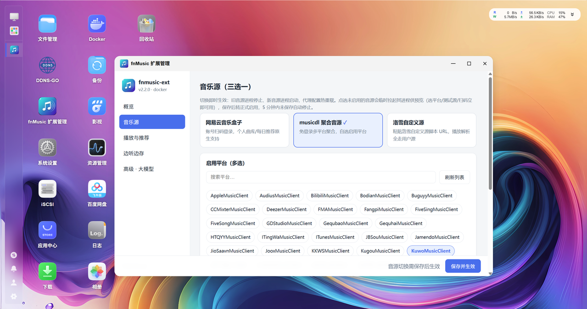

# fnmusic-ext 飞牛音乐扩展代理

Gitee：https://gitee.com/javycoder/fnos_music_ext

GitHub：https://github.com/javycoder/fnos_music_ext

[](https://github.com/javycoder/fnos_music_ext/actions/workflows/ci.yml)

`fnmusic-ext` 是专为 fnOS（飞牛私有云）自带音乐应用（`trim.music`）打造的**无侵入增强扩展**。它通过接管官方后端的 Unix Socket 通信入口，在完全不修改官方程序、nginx 配置与数据库的前提下，让原生飞牛音乐获得在线音乐能力；可随时一条命令还原官方直连。



## 功能特性

- **在线聚合搜播**：在官方搜索框输入歌名，聚合三大音源之一的曲库（见下），在线歌曲即点即播，自动补齐滚动歌词与高清封面。搜索结果严格**本地优先**：本地曲库条目始终排在前面，在线音源结果（网易 > musicdl > 洛雪）紧随其后；翻页时若在线结果不够填满一页，自动向音源继续取下一页补齐（**深分页**，可关；musicdl 仅参与首屏），详见 [docs/SEARCH_PAGINATION.md](docs/SEARCH_PAGINATION.md)；
- **三音源单选**（v2.0.0 起互斥，可在 WebUI 秒级切换）：
  - [musicbox](https://github.com/darknessomi/musicbox)：网易云高品质解析，支持扫码登录 VIP/无损曲库与原生每日推荐；
  - [musicdl](https://github.com/CharlesPikachu/musicdl)：酷我/咪咕等 57 个平台聚合，可按平台粒度勾选（编号见 [musicdl-service/PLATFORMS.md](musicdl-service/PLATFORMS.md)）。部分音乐源歌曲少，或返回的音乐不可播放，请自行测试并使用可靠音乐源；
  - **lxmusic**：洛雪音乐自定义源运行时——搜索/歌词/榜单走内置平台接口，播放解析由你提供的洛雪自定义源脚本（在容器内执行）完成。源脚本支持三种配置方式：**粘贴 URL**、**上传电脑上的 `.js` 文件**、**从 NAS 选择 `.js`**（飞牛桌面内）。支持**多源同时激活**（v2.8.0 起）：列表里可勾选多个源一起生效，解析失败自动在启用的源之间接力切换；`install.sh --lx-source-url` 也支持逗号分隔一次配置多个。导入 URL 或 `.js` 前必须自行确认来源安全，不要导入来历不明的脚本；脚本在容器内执行。搜索结果以及能否播放视源脚本而定；
- **管理 WebUI**（可选，仅本机 8774）：在已登录的飞牛管理员页面打开。浏览器里完成音源切换、musicdl 平台勾选、网易扫码、洛雪源配置（URL/上传/NAS 选择）与测试保存、音质偏好、储存（边听边存/目录设置）、推荐开关与 LLM 配置，全部热生效；
- **音质偏好**：`高音质`（从高到低）/ `平衡`（取中间档）/ `流畅`（优先最低）三种模式，覆盖全部音源；只影响在线播放/搜索取源档位；
- **下载音质**（v2.8.0 起）：`跟随 App`（默认，App 明确选"标准"才交 MP3 320k，其余一律交付无损原文件）/ `无损原文件` / `MP3 320k`；只影响 App 里点"下载"拿到的文件，无损歌曲不会被擅自转成 MP3；
- **智能边听边存**：在线听歌时后台自动缓存，再次播放本地秒开；可选完整试听后保存进本地曲库；
- **自定义储存目录**（v2.8.0 起）：歌曲缓存目录与下载目录（边听边存保存位置）可分开自定义，WebUI「储存 → 目录设置」里从飞牛文件选择器选目录（选择即完成应用授权）或直接粘贴路径，保存前按宿主真实落盘视角校验目录可写；缓存目录变更时自动迁移去重标记，旧缓存文件不迁移；
- **自动下载封面**：自动保存到本地曲库的歌曲（边听边存 / 收藏自动绑定本地）落库后自动把封面内嵌进音频文件，飞牛音乐 App 里下载的歌即有封面图（可在 WebUI 关闭）；
- **自动下载歌词**（v2.6.0 起，默认关）：自动保存到本地曲库的歌曲在完整下载成功后，自动下载同名 `.lrc` 歌词放到歌曲同一个文件夹，官方 App 扫描入库后播放即显示歌词；下载失败不产生歌词文件（可在 WebUI 开启）；
- **推荐体系**：「热门推荐」与「每日推荐 MM-DD」两个独立歌单、独立开关；默认采信音源原生推荐，未启用网易时可配 OpenAI 兼容大模型兜底；歌单封面取列表里第一首有封面的曲目；
- **网易账号歌单**（v2.6.0 起，默认关）：网易盒子扫码登录后，账号里自己创建的歌单以只读歌单出现在音乐页「热门推荐」下方、官方歌单上方，点开即听（曲目经可播过滤）；在音乐页加歌/移歌/删除不回写网易；
- **多用户隔离收藏**：家庭多成员的红心收藏彼此独立，与本地曲库融合。

## 架构

```text
[飞牛音乐客户端 Web / App / 车载]
            │
            ▼
      [飞牛 Nginx]（Unix Socket）
            │
┌─────────────────────────────────────────────────────────┐
│ fnmusic-ext 代理（宿主机 systemd，零侵入接管 Socket）     │
│   ├─ 本地接口透传 ──► 官方后端 (upstream socket)          │
│   ├─ 在线搜索/播放/歌词/封面/收藏                         │
│   ├─ 边播边存 Tee 落盘                                   │
│   └─ .env 热重载（2s 检测，白名单键免重启生效）           │
└───────────────┬─────────────────────────────────────────┘
                │ 127.0.0.1（音源仅本机；WebUI 供浏览器）
┌───────────────▼─────────────────────────────────────────┐
│ 音源形态二选一（.env: FNMUSIC_DEPLOY_MODE）               │
│ docker（默认）: 单容器 fnmusic-sources（supervisor 按需）  │
│   ├─ musicdl  127.0.0.1:8768 → 容器 8001                 │
│   ├─ musicbox 127.0.0.1:8770 → 容器 8002（扫码走 WebUI） │
│   ├─ lxmusic  127.0.0.1:8772 → 容器 8003                 │
│   └─ WebUI    127.0.0.1:8774 → 容器 8004（飞牛管理员） │
│ native（无 Docker）: 宿主机 systemd + supervisord 按需加载 │
│   四程序直接监听同一组 127.0.0.1 发布端口，功能完全一致    │
│   （两种形态均只启动当前所选音源进程 +可选 WebUI；         │
│     切换音源 = supervisorctl 秒级 stop/start）             │
└─────────────────────────────────────────────────────────┘
```

核心代理必须在宿主机以 systemd 运行（接管 Socket）；三个音源 + WebUI 默认合并为一个 Docker 容器，镜像内由 supervisor 管理四个程序，启动时读取挂载的 `.env` 只拉起所选进程——常驻内存约 100-200MB。机器上没有 Docker 时可改用原生部署（`./install.sh --deploy native`，详见 [docs/INSTALL.md](docs/INSTALL.md)），功能与 Docker 形态完全一致。

## 快速开始

### 前置条件

1. fnOS 已在「应用中心」安装并启动官方**飞牛音乐**应用；
2. 音源形态二选一：**Docker**（默认，未安装时会报错退出）或原生部署（`--deploy native`，需要 Python 3.10+，nodejs/ffmpeg 缺失时自动补装）。

### 安装（推荐：应用中心 fpk 包）

从 [GitHub Releases](https://github.com/javycoder/fnos_music_ext/releases) 下载最新 `fnmusic-ext-<版本>.fpk`，在 fnOS「应用中心 → 手动安装」选择该文件，按向导选择**初始音源**即可自动完成安装并启用。

- 桌面会出现「fnMusic 扩展管理」图标，点击即在飞牛桌面窗口内打开管理页（音源切换/扫码登录/平台选择/洛雪源配置）；
- 选洛雪音源时向导不索要任何源信息：装好后打开管理页，在「音乐源 → 洛雪自定义源」里粘贴脚本 URL、上传电脑 `.js` 文件或从 NAS 选择，点源的「激活」做标记后保存即生效；支持多个源同时激活，解析失败自动在启用的源之间接力切换；
- 在应用中心可随时「停止」（秒级还原官方直连）与「启动」（恢复扩展）；
- 卸载前会自动把配置与数据（.env、网易云登录、收藏、播放历史）备份为存储卷根目录的 `fnmusic-ext-backup-<时间戳>.tar.gz`，需要彻底清理时手动删除该文件即可；
- 也可用命令行安装：`sudo appcenter-cli install-fpk fnmusic-ext-<版本>.fpk`。

> 升级：应用中心内直接安装新版本 fpk（升级前自动备份用户数据，升级后恢复）。命令行 `install-fpk` 在已安装时不会升级，请在应用中心操作。

### 安装（进阶：git clone 脚本安装）

适合需要修改代码或精细控制参数的用户：

```bash
sudo apt-get update && sudo apt-get install -y python3 python3-venv git
git clone https://github.com/javycoder/fnos_music_ext.git fnmusic_ext
cd fnmusic_ext
chmod +x install.sh extend.sh restore.sh proxy/run_proxy.sh
./install.sh
```

向导依次引导：**音源三选一**（1 网易云 musicbox → 扫码登录；2 musicdl → 平台多选；3 洛雪 → 直接安装，源脚本装后在管理页配置）→ **是否安装管理 WebUI**（默认否）→ 可选 LLM 推荐配置 → 自动执行 `./extend.sh` 接管验收。

非交互示例：

```bash
# 网易云 + WebUI
./install.sh --non-interactive --sources musicbox --webui --extend

# musicdl（酷我+咪咕精选）
./install.sh --non-interactive --sources musicdl --extend

# 洛雪自定义源（可选直接给源：http(s) URL 或本机 .js 文件路径，逗号分隔可配多个同时激活；
# 不给则无源安装，装好在管理页 WebUI 里配置 URL / 上传 .js / NAS 选择）
./install.sh --non-interactive --sources lxmusic \
  --lx-source-url 'https://example.com/your-source.js' --extend
./install.sh --non-interactive --sources lxmusic \
  --lx-source-url 'https://a.example.com/src1.js,https://b.example.com/src2.js' --extend  # 多源同时激活
./install.sh --non-interactive --sources lxmusic \
  --lx-source-url "$HOME/scripts/my-source.js" --extend   # 本机路径自动复制进数据卷
./install.sh --non-interactive --sources lxmusic --webui --extend  # 无源安装
```

### 验证

```bash
# 组件健康状态
curl -s --unix-socket /var/run/trim_music.socket http://localhost/_ext/healthz

# WebUI（若安装）：飞牛桌面「fnMusic 扩展管理」，或已登录管理员打开 /app/fnmusic-ext
```

打开飞牛音乐 Web 端或 App，搜索「晴天」等关键词即可试听在线歌曲。

### 日常运维

```bash
./extend.sh          # 重新启用/自检（改 .env 后重启容器并验收）
./restore.sh         # 秒级还原官方直连（保留 .env 与全部数据）
./restore.sh --full  # 彻底清理（连配置/登录态/缓存/收藏一并删除）
```

网易云扫码（musicbox 源）：终端 `./install.sh --qr`，或登录管理页后在「音乐源」扫码。

> 部署形态细节、单机多副本约束（`--adopt`）、洛雪源配置与故障排查见 [docs/INSTALL.md](docs/INSTALL.md)。

## 配置参考

配置集中在项目根目录 `.env`（安装向导生成维护，权限 600），完整键项见 [.env.example](.env.example)。常用项：

| 配置项 | 默认值 | 说明 |
| :--- | :--- | :--- |
| `FNMUSIC_MUSICDL_ENABLED` / `FNMUSIC_NETEASE_ENABLED` / `FNMUSIC_LX_ENABLED` | 单选 | 三音源互斥开关，只能一个为 `true`（热重载） |
| `FNMUSIC_WEBUI_ENABLED` | `false` | 管理 WebUI 开关（仅本机 8774，飞牛管理员打开） |
| `LX_SOURCE_URL` | *(空)* | 洛雪自定义源脚本地址：`http(s)://` URL 或 `file:///data/lxmusic/uploads/<名字>.js`（管理页上传/NAS 选择生成）；多源激活时为派生字段 = 第一个激活项；建议在 WebUI 里配置 |
| `LX_SOURCE_LIST` | `[]` | 洛雪源列表（JSON，管理台维护）：`[{"name":"备注","url":"…","active":true},…]`，多个 `active:true` 的源**同时激活**，解析失败自动接力切换 |
| `LX_SOURCES` | `kg,wy,mg,kw` | lxmusic 启用的平台（kg/wy/mg/kw/tx） |
| `FNMUSIC_ONLINE_SOURCES` / `MUSICDL_SOURCES` | 酷我+咪咕 | musicdl 平台白名单（短名/全名均可） |
| `FNMUSIC_QUALITY_MODE` | `high` | 音质偏好：`high` / `balanced` / `smooth`（热重载；只影响在线取源档位） |
| `FNMUSIC_DL_QUALITY` | `app` | 下载音质：`app` 跟随 App 显式请求（未知/缺省一律交付原文件，不再擅自转 MP3）/ `original` 强制原文件 / `standard` 强制 MP3 320k（热重载） |
| `FNMUSIC_TEE_SAVE_ENABLED` | `true` | 边听边存开关；`FNMUSIC_TEE_SAVE_DIR` 留空自动探测飞牛共享曲库 |
| `FNMUSIC_TEE_SAVE_DIR` / `FNMUSIC_CACHE_DIR` | *(空)* | 下载目录（边听边存保存位置）/ 歌曲缓存目录，可分开自定义；留空=自动探测共享曲库 / 安装目录 `cache`。WebUI「储存 → 目录设置」可改（热重载，缓存目录变更自动迁移 `.ref` 去重标记）；两者不能相同或互为父子 |
| `FNMUSIC_TEE_CACHE_MAX` | `2` | 关闭边听边存时滚动保留的试听缓存条数（仅关闭时生效） |
| `FNMUSIC_TRANSCODE_ENABLED` | `true` | App 音质偏好为"标准"时在线歌曲由 ffmpeg 实时转码 AAC 分片流播放（热重载）；配套 `FNMUSIC_TRANSCODE_BITRATE`（128k）、`_HLS_TIME`（10 秒/片）、`_MAX_SESSIONS`（并发 2）、`_TTL_S`（停止心跳 90 秒后回收）、`_CACHE_MAX_MB`（转码缓存 512MB，最久未用先清）、`_DL_BITRATE`（转码下载标准档 320k，与官方一致） |
| `FNMUSIC_AUTO_COVER` | `true` | 自动下载封面：落库歌曲自动内嵌源站封面，官方 App 显示封面图（热重载） |
| `FNMUSIC_LYRIC_AUTO_DL` | `false` | 自动下载歌词：歌曲完整落库成功后自动下载同名 `.lrc` 到歌曲所在目录（热重载） |
| `FNMUSIC_RECOMMEND_HOT` / `FNMUSIC_RECOMMEND_DAILY` | `true` | 「热门推荐」/「每日推荐」两个独立歌单的开关（热重载） |
| `FNMUSIC_NETEASE_MY_PLAYLISTS` | `false` | 网易账号歌单：启用网易盒子并扫码登录后，账号自建歌单以只读歌单出现在音乐页「热门推荐」下方（热重载） |
| `FNMUSIC_COVER_ENRICH` | `true` | 缺失封面用网易曲库补全（热重载） |
| `FNMUSIC_LLM_BASE_URL` 等 | *(空)* | 大模型每日推荐兜底（OpenAI 兼容，热重载） |
| `FNMUSIC_ENV_WATCH` | `true` | .env 热重载总开关 |

## 从 v1.x 升级

v2.0.0 是**架构级重构**：部署形态（三容器→单容器）、数据目录（`musicbox-data/`→`sources-data/`）、配置键（`LX_THIRD_PARTY` 移除）均有变化。**推荐先还原再安装**，让升级从干净状态开始（`.env` 与全部数据保留，不会丢配置）：

```bash
cd /path/to/fnmusic_ext
git pull
./restore.sh      # 先还原官方直连并清理旧部署（v2 的 restore 兼容清理 v1.x 旧容器/宿主机服务）
./install.sh      # 全新安装 v2.0.0，按向导三选一
```

直接原地升级（`git pull && ./install.sh`）同样支持——安装器会自动迁移数据目录、清理旧三容器，遇到多源并存的旧 `.env` 会要求重新三选一。但机器状态复杂时（曾混用 host/Docker 模式、历经多次版本升级），先 `./restore.sh` 再安装更稳妥省心。

另注意两点行为变化：

1. **三音源互斥**：旧版多音源并存的 `.env` 会被要求重新单选（想换源时在 WebUI 里秒切）；
2. **`LX_THIRD_PARTY` 移除**：lxmusic 不再内置第三方聚合解析链，播放解析完全由你的洛雪自定义源脚本提供（安装或 WebUI 中配置）。

平台编号变化：`53`（zhuolin）已随上游 musicdl 2.13.11 下线退役，编号永久空缺；新增 `64`（yinyueku）。

## 常见问题

- **WebUI 打不开**：确认安装时选择了 WebUI，或 `.env` 中 `FNMUSIC_WEBUI_ENABLED=true` 后运行 `./extend.sh`。用飞牛管理员打开桌面「fnMusic 扩展管理」或 `/app/fnmusic-ext`，不要直接访问 8774。
- **洛雪源播放失败**：源脚本由第三方提供，在容器内执行。导入前必须自行确认来源安全，不要导入来历不明的脚本。可在 WebUI 中用「测试」按钮验证源可用性，失败时更换源 URL 或重新上传脚本文件。
- **musicdl 某平台搜索为空**：上游接口变化所致，不影响其他平台；可升级 musicdl（`>=2.13.11`）后重建镜像。
- **切源后内存没有变化**：切换在容器内完成，`docker stats fnmusic-sources` 稍等片刻后查看；未启用音源进程会被停止而非休眠。
- **改了 `.env` 不生效**：热重载仅覆盖白名单键（音源开关/音质/推荐/边听边存/储存目录/LLM 等）；端口、`MUSICDL_SOURCES` 等其余改动需执行 `./extend.sh` 重启容器。

## 开发与测试

```bash
python3 -m pytest        # 全量测试（无需 Docker/飞牛环境）
```

仓库结构：`proxy/`（核心代理）、`musicdl-service/`、`musicbox-service/`、`lxmusic-service/`（容器内音源）、`webui-service/`（管理界面）、`container/`（单容器构建与编排）、`packaging/fpk/`（应用中心 fpk 打包）。

### fpk 打包与发布

```bash
./packaging/fpk/build.sh   # 本地打包：组装 + fnpack 校验 → dist/fnmusic-ext-<版本>.fpk
```

- 版本号唯一来源为根目录 `VERSION`，打包时注入 manifest；
- CI 在每次 push/PR 都会构建一次 fpk 防止结构回归；推送 `v<版本>` tag 会自动构建并把 `.fpk` 与校验和发布到 GitHub Release（tag 需与 `VERSION` 一致）；
- 打包结构由 `packaging/tests/test_fpk_pack.py` 离线校验（含 fnpack 实测校验规则）；
- 实机安装/卸载自动测试（需在飞牛设备上以 root 运行）：

```bash
sudo python3 tests/integration/fpk_lifecycle.py --auto-restore
```

## 免责与版权声明

- 本项目基于 **MIT 许可证** 开源（见 [LICENSE](LICENSE)），严格限定于**个人技术研究与非商业用途**；
- 本项目是协议中继与数据适配层，不托管、不分发任何受版权保护的音频与元数据；音频及元数据版权归属各原始版权方，请支持正版；
- 洛雪自定义源脚本等第三方代码由使用者自行提供并在容器内执行。导入 URL 或 `.js` 前必须自行确认来源安全，不要导入来历不明的脚本，且仅访问您有权收听的内容；
- 使用者应遵守所在国家/地区法律法规与第三方平台用户协议；因滥用导致的任何责任由使用者自行承担。

上游致谢：[CharlesPikachu/musicdl](https://github.com/CharlesPikachu/musicdl)、[darknessomi/musicbox](https://github.com/darknessomi/musicbox)、洛雪音乐（LX Music）社区及其自定义源规范。
